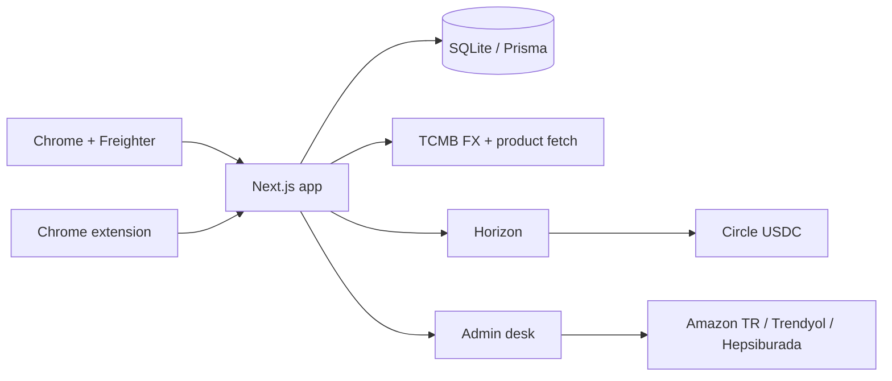

# SP3ND pitch — Rise In × Stellar Pro Hackathon 2026

Official Stellar template was **TBD** at build time. This deck follows the published 6 judging criteria plus the required Why / MVP / technical / demo structure.

| File | Use |
| --- | --- |
| [SP3ND-Stellar-Pro-Hackathon.pptx](./SP3ND-Stellar-Pro-Hackathon.pptx) | Editable slides (PowerPoint / Keynote / Google Slides) |
| [SP3ND-Stellar-Pro-Hackathon.pdf](./SP3ND-Stellar-Pro-Hackathon.pdf) | Submit / send this |

Slides are **English** for the Stellar jury. Speaker notes on each slide are **Turkish**.

Rebuild:

```sh
cd pitch
npm install
node presentation.js
```

Then export PDF from Keynote or PowerPoint.

## Slide map

1. Title
2. Problem (criterion 1)
3. Who benefits (criterion 1)
4. Value proposition
5. Seven-step user flow (criterion 2 + 4)
6. Product screens (criterion 4)
7. Quote formula + payment safety (criterion 2)
8. Architecture (criterion 2 + 3, Scale mermaid below)
9. Stellar integrations (criterion 3)
10. What is real vs out of scope (criterion 2)
11. Roadmap → SCF / InstaAwards (criterion 5)
12. Live demo script = `DEMO.md`
13. How judges run the repo (criterion 6)
14. Close

## Scale Track mermaid

Paste this into the project README if the track asks for an architecture diagram:



This MVP uses **classic Stellar USDC payments** (Horizon + memo + timebounds), not a Soroban contract. TR Mock Anchor (SEP-6 / 10 / 38) and Soroban escrow are the 90-day next step — do not claim they are live.
